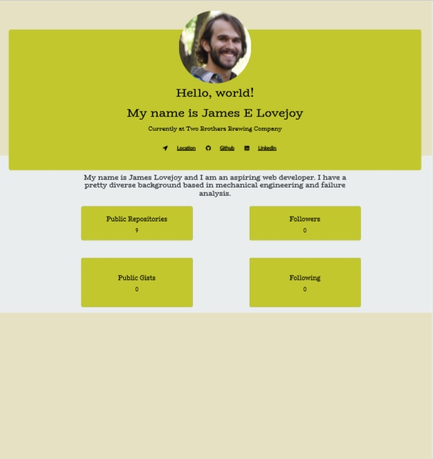

## Profile Generator: Enter a color option, github username, and linkedIn url and generate an elegantly designed pdf of yourself to send to employers

the link to our page is shown below:
https://jlovejo2.github.io/profile_generator/

## Table of Contents
* [Version 1.0](#version-1.0)
* [The Generated Profile](#the-generated-profile)
* [How To Use](#how-to-use)
* [Apis Used](#apis-used)
* [CSS Framework](#css-framework)
* [Team Members](#team-members)
* [Coding Languages Used](#coding-languages-used)
* [Functions Used](#functions-used)
* [Known Issues With Code](#known-issues-with-code)

## Version 1.0
* This profile generator runs in by entering node index.js in the command.
* Make sure you are in the develop folder when running the code on the command line.

## The Generated Profile:
* The Generated profile comes with four different color schemes so far.  See the below images for examples. 
 

## How To Use
* The user goes into the develop folder and runs the code by entering "node index.js"
* user will be prompted for a color choice, github username, and linkedIn public url
* pdf will automatically be named "profile_github username" and saved to the folder code is run in.
* See attached gif for functionality

## NPMs Used:
* NPM inquirer
* NPM axios
* NPM electron-html-to

## CSS Framework:
* Bootstrap

## Coding Languages Used
* HTML
* CSS
* Javascript
* node

## Functions Used
* generateHTML - this function receives three parameters.  The github resp object, user color input, and linkedIn url.  It places the proper content in html using temperal literals and then returns this html

## Known Issues With Code
* if a pdf with same name is open on your computer and you try to create a new pdf the code will error out
* the code breaks if a github username is not entered.
